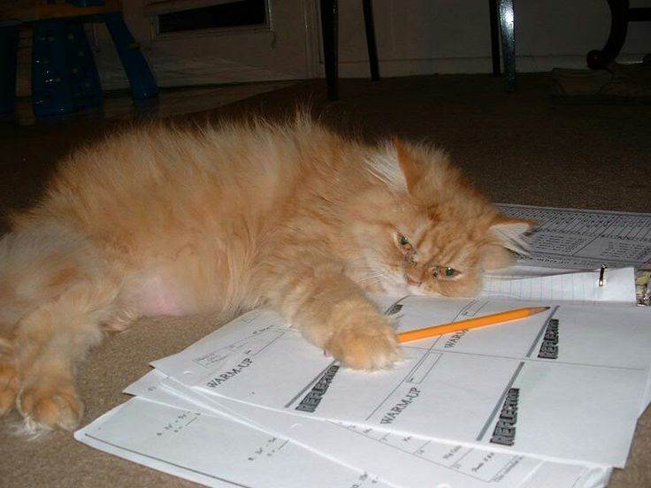

<!DOCTYPE html>
<html lang="en">
<head>
    <meta charset="UTF-8">
    <meta name="viewport" content="width=device-width, initial-scale=1.0">
    <title>How to prioritize your acads while avoiding neglecting yourself</title>
    <link rel="stylesheet" href="styles.css"> <!-- Link to your custom CSS file -->
    
</head>
<body>

    <header>
        <h1>How to prioritize your acads while avoiding neglecting yourself</h1>
        

            <input type="text" placeholder="Search...">
            <button type="button">Search</button>
        

    </header>
<h2><b>Introduction</b></h2>
            
<i>As a student like me I know some of you are stressed in academics 'cause some of you
                have your own responsibilities so that's why I decided to create a website just to all of you.
                I know sometimes we lost motivation to do what we need to do because no one motivates us.
                So that's why I am here to motivate all of you as I motivate myself.
            </i>

            
In this website I'll give you some motivations on how to prioritize your academics as you prioritize yourself.
                Yes, sometimes we are lazy to do our homeworks or activities that has been given to us because we are not using our
                time in a right way.
            

            
                
            </style>
          </head>
          <body>
            

            
As you can see above the picture shows of laziness, yes I do also feel it sometimes but I told to myself that laziness
                won't lead the way because it won't help me at the end of the day. I know if the laziness will overcome you, you would
                definitely cram alot. Someone would say "Cramming is LIFE" LOL!
            

            
But that's not the right thing to do okay? If you cram alot it would cause stress and anxiety please don't let that happen
                I know being a student is tough but we can do this everyone! All of us have a bright future ahead so there's alot of steps we
                have to walk up and unlock those doors that has been waiting for us upstairs. All of us wants a bright future right? Spend
                time with our friends and love ones. But you need to have courage and motivations in order to that.
            

            
And the purpose of this website is to motivate you guys to stop those laziness and start prioritizing our acads while 
                take caring of ourselves because we definitely need it everytime we face a new day everyday!
            

            

            
Don't say this because it won't literally help you to be honest, because it will absolutely just cause 
                cramming 
            

            

            
Instead, just say <i><b>I CAN DO IT!</b></i> and I know a hundred percent you won't regret anything. I got you!

            
So you'll see 2 more pages here on which will focus on how to prioritize your academics
                and the other one will focus on how to take good care of yourself.
                I really hope you all will like it 'cause I made this website just for you guys.
                I also wanted to help to those people who are lack of motivations to do anything so 
                let's start! Shall we?
            

            

            
Feel free to choose what you want to read ^^

            

            
1. <a href="How to prioritize your acads.html"> <button>Learn how to Prioritize your academics</button></a>

            
2. <a href="Prioritize yourself.html"> <button>Learn how to Prioritize yourself</button></a>

            
</body>
</html>
<!DOCTYPE html>
<html lang="en">
<head>
    <meta charset="UTF-8">
    <meta name="viewport" content="width=device-width, initial-scale=1.0">
    <title>How to prioritize your acads while avoiding neglecting yourself</title>
    <link rel="stylesheet" href="styles.css"> <!-- Link to your custom CSS file -->
    
</head>
<body>

    <header>
        <h1>How to Prioritize Your Academics</h1>
        

            <input type="text" placeholder="Prioritize your academics...">
            <button type="button">Search</button>
        

    </header>

    
<a href="page 1.html"> <button>Back</button> </a>

<h2><b>Start Prioritizing your academics (SPYA)</b></h2>
            
So this is the interesting part, prioritizing your academics might be challenging,
                sometimes the barrier will come in our space. You know what I mean? The laziness and do you guys know what is the main 
            aspect of laziness? Well the main aspect of <b>laziness</b> is being addicted on mobile phones as well as mobile games.
            I've seen alot of students in my school who were obsessed in mobile games such as <b>Mobile legends,COC, Call of Duty</b> and
            <b>many more...</b>
            

            
And today, I'll give you some key pointers on how to <b>Prioritize your academics</b> to avoid cramming shall we start?

                

                
Remember kitty is watching you so you can do it!

                
<b>1. Set Clear Semester Goals:</b>

                
Establish specific academic goals for each semester, outlining what you aim to achieve in terms of grades, projects, and personal development. 
                    This clarity helps in structuring your priorities.

                        
<b>2. Create a Weekly Schedule:</b>

                        
Develop a detailed weekly schedule that allocates dedicated time for each subject, assignments, and revision. A well-organized timetable 
                            minimizes the chances of last-minute cramming.

                        
<b>3. Break Down Large Tasks:</b>

                        
Divide substantial assignments or projects into smaller, manageable tasks. Tackling tasks incrementally over time prevents the need for frenzied cramming sessions close to deadlines.

                        
<b>4. Use a Planner or Calendar:</b>

                        
Utilize a planner or digital calendar to keep track of deadlines, exams, and important dates. This visual aid ensures that you are aware of upcoming commitments and can plan accordingly.

                        
<b>5. Prioritize Based on Importance:</b>

                        
Identify and prioritize tasks based on their significance and deadlines. Focus on high-priority items first to ensure that critical assignments are completed well in advance.

                        
<b>6. Establish a Productive Study Environment:</b>

                        
Create a conducive study environment that minimizes distractions and enhances concentration. A dedicated space for studying can improve efficiency, reducing the likelihood of last-minute cramming.

                        
<b>7. Regular Review and Revision:</b>

                        
Incorporate regular review sessions into your schedule to reinforce previously learned material. This approach helps in retaining information over time, reducing the need for intensive cramming before exams.

                        
<b>8. Seek Help Early:</b>

                        
If you encounter difficulties in understanding a concept, seek help from teachers, classmates, or tutors promptly. Addressing challenges early prevents accumulation of unresolved issues that may lead to last-minute cramming.

                        
<b>9. Practice Effective Note-Taking:</b>

                        
Develop efficient note-taking techniques during lectures to capture key points. Well-organized and comprehensive notes serve as valuable study resources, reducing the need for last-minute extensive review.
                        

                        
<b>10. Maintain a Healthy Work-Life Balance:</b>

                        
Recognize the importance of balance in your life. Allocate time for leisure activities, relaxation, and adequate sleep. A well-balanced lifestyle supports sustained focus and reduces the likelihood of needing to cram due to exhaustion or stress.

                        

                        
Oh look kitty wants to give you some motivations to cheer y'all up

                        
<b>MOTIVATIONS OF THE DAY!</b>

                        
<i><b>"The more that you read, the more things you will know. The more that you learn, the more places you'll go."</i></b> - <b>Dr. Seuss<b>

                            
<i>"The future belongs to those who believe in the beauty of their dreams."</i> - <b>Eleanor Roosevelt</b>

                            
<i><b>"Believe you can and you're halfway there."</i> - <b>Theodore Roosevelt</b>

                            
<b><i>"The expert in anything was once a beginner."</i> - <b>Helen Hayes</b>

                            
<b><i>"The will to win, the desire to succeed, the urge to reach your full potential... these are the keys that will unlock the door to personal excellence."</i> - <b>Confucius</b>

                            
<b><i>"The only way to do great work is to love what you do."</i> - <b>Steve Jobs</b>

                            
<b><i>"Success is no accident. It is hard work, perseverance, learning, studying, sacrifice, and most of all, love of what you are doing or learning to do."</i> - <b>Pelé</b>

                            
2. <a href="Prioritize yourself.html"> <button>how to Prioritize yourself</button> </a>

                    

<!DOCTYPE html>
<html lang="en">
<head>
    <meta charset="UTF-8">
    <meta name="viewport" content="width=device-width, initial-scale=1.0">
    <title>How to prioritize your acads while avoiding neglecting yourself</title>
    <link rel="stylesheet" href="styles.css"> <!-- Link to your custom CSS file -->
    
</head>
<body>

    <header>
        <h1>How to prioritize yourself</h1>
        

            <input type="text" placeholder="Prioritize yourself now...">
            <button type="button">Search</button>
        

    </header>
    
<a href="How to prioritize your acads.html"> <button>Back</button></a>

<h2><b>Start Prioritizing Yourself!</b></h2>
            
I know some of us might find it as difficult, but to other people they prioritize themselves all the time
                while other people don't. Taking care of yourself is like putting on your own oxygen mask first before helping others on a plane. 
                It's about looking out for number one so you can be your best for everyone else. Kinda like when you charge your phone before a big day
                 – you gotta recharge yourself too. Eat good food, get some sleep, and don't forget to do stuff that makes you happy, whether it's watching a show,
                  playing a game, or just chilling. It's not being selfish; it's like making sure your car has enough gas to go the distance. You matter, and taking 
                  care of yourself is like giving yourself a high-five for being awesome.

            

            
Remember, it's okay to say "no" sometimes. You're not a superhero, and even superheroes need a break. If taking on extra stuff is like piling up too many bags at once, it's totally fine to say, "I can't carry all that right now." It's not about letting people down; it's about making sure you're not carrying more than you can handle. Just like your backpack has a limit, so do you.

            
And don't forget the power of a good laugh. It's like a mini-vacation for your brain. Whether it's a funny video, a joke with friends, or just being goofy on your own, laughter is like a little reset button. So, when things get a bit much, throw in a joke, watch a funny cat video, or do whatever makes you crack a smile. It's like giving your mind a quick vacation – a chance to recharge and face whatever comes next with a grin.

            

            
Sometimes, taking a step back is like hitting the pause button in a movie. It's okay to slow down and catch your breath. Life can be like a fast-paced song, but taking a moment to appreciate the quiet beats is important too. Whether it's a short walk, a few minutes of deep breathing, or just sitting with a cup of tea, it's like giving yourself a timeout to recalibrate. You're not missing out; you're just finding a balance.

            
And hey, surround yourself with good vibes. It's like having a favorite song playing in the background of your day. Hang out with people who lift you up and make you feel awesome. It's not about having a huge crowd; it's about having those few pals who add positivity to your playlist of life. Just like a good song can turn your mood around, good company can make your day better. So, keep the good vibes flowing and let the positivity be your background melody.

            

            
So putting ourselves first is crucial and now here's a list of motivation quotes to all of you!

            <h4>QUOTES OF THE DAY!</h4>

            <P1><b>1. "You can't pour from an empty cup. Take care of yourself first."</b></P1>
            

            
<b>2. "Self-care isn't selfish; it's an essential investment in your well-being."</b>

            
<b>3. "Remember, you're just as important as anyone else in your life. Prioritize yourself." </b> 

            
<b>4. "Taking time for yourself isn't a luxury; it's a necessity. Your well-being matters." </b>

            
<b>5. You are not obligated to do more than you can handle. Make self-care a priority, not an afterthought." </b>

            
<a href="Last page message.html"> <button>Creator's Message</button></a>

            
[Uploading Last <!DOCTYPE html>
<html lang="en">
<head>
  <meta charset="UTF-8">
  <meta name="viewport" content="width=device-width, initial-scale=1.0">
  <title>My Web Presence</title>
  
</head>
<body>

  

    <!-- Your profile picture -->
    

    <!-- Your last message -->
    

      
You did it! You reached the last page of this website and I'm so proud of you! I really hope it helps you alot and 
        I promise I'll do my best to make an amazing content like this. Thank you so much for reading! I really appreciate it!
        and now I hope you all are motivated and good, oh I almost forgot if there's a case if you are choosing between relationship and reputation
        you should probably choose your reputation why? It's because love can wait all the time, just focus hooking up your goals and be successful! ^^
        PEACE OUT! <b>-Lester</b>
       
      

      
<b> Don't hesitate do connect with me on my social media accounts!</b>

      <audio controls>
        <button>Please play the audio</button><source src="Last voice.3gpp" type="audio/mp3">
        
    

    

    <!-- Social media links -->
    

      <!-- Replace these links with your actual social media profiles -->
      <a class="social-media-link" href="https://twitter.com/lesterrustro134">Twitter</a>
      <a class="social-media-link" href="https://web.facebook.com/lester.wolfe.507">Facebook</a>
      <a class="social-media-link" href="https://www.youtube.com/channel/UC_yync2G71VeVwHAqjjWWIg">Youtube</a>
      <button>
<a href="page 1.html">Back to start</a>
</button>
    

  

  
  
</body>
</html>
page message.html…]()
